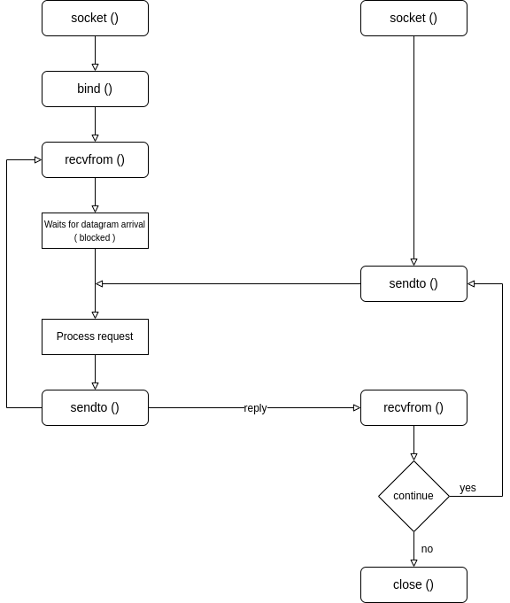

# UDP Client-Server implementation in C

In UDP, the client does not form a connection with the server like in TCP and instead just sends a datagram.  
Similarly, the server need not accept a connection and just waits for datagrams to arrive.  
Datagrams upon arrival contain the address of the sender which the server uses to send data to the correct client.

## The entire process can be broken down into the following steps:



## Steps for the server:

1. Create a UDP socket
2. Bind the socket to the server address
3. Wait until the datagram packet arrives from the client
4. Process the datagram packet and send a reply to the client
5. Go back to Step 3

## Steps for the client:

1. Create a UDP socket
2. Send a message to the server
3. Wait until response from the server is received
4. Process reply and go back to step 2, if necessary
5. Close socket descriptor and exit

## Functions

```
int socket (int domain, int type, int protocol)
```
Creates an unbound socket in the specified domain.  
Returns socket file descriptor.

**Arguments:**

- domain: specifies the communication (AF_INET for IPv4/ AF_INET6 for IPv6)[^1]
- type: type of socket to be created (SOCK_STREAM for TCP / SOCK_DGRAM for UDP)[^2]
- protocol: protocol to be used by the socket. 0 means use default protocol for the address family[^3]

```
int bind (int sockfd, const struct sockaddr *addr, socklen_t addrlen)
```
Assigns address to the unbound socket.

**Arguments:**
- sockfd: socket file descriptor
- addr: structure in which address of a socket is specified[^4]
- addrlen: size of addr structure

```
ssize_t sendto (int sockfd, const void *buf, size_t len, int flags,
                const struct sockaddr *dest_addr, socklen_t addrlen)
```
Send a message on the socket.

**Arguments:**

- sockfd: file descriptor of the socket
- buf: application buffer containing the data to be sent
- len: size of *buf* application buffer
- flags: bitwise OR of flags to modify socket behavior
- dest_addr: structure containing the address of the destination
- addrlen: size of *dest_addr* structure

```
ssize_t recvfrom (int sockfd, void *buf, size_t len, int flags,
                 struct sockaddr *src_addr, socklen_t *addrlen)
```
Receive a message from the socket.

**Arguments:**

- sockfd: file descriptor of the socket
- buf: application buffer in which to receive data
- len: size of *buf* application buffer
- flags: bitwise OR of flags to modify socket behavior
- src_addr: structure containing source address is returned
- addrlen: variable in which size of *src_addr* structure is returned

```
int close (int fd(sockfd))
```
Close a file descriptor.

**Arguments:**

- sockfd: socket file descriptor

 [^1]: We use AF_ LOCAL as defined in the POSIX standard for communication between processes on the same host.  
    For communicating between processes on different hosts connected by IPV4, we use AF_INET and AF_I NET 6 for processes 
    connected by IPV6.

[^2]: SOCK_STREAM: TCP(reliable, connection oriented)  
      SOCK_DGRAM: UDP(unreliable, connectionless)

[^3]: This is the same number which appears on protocol field in the IP header of a packet. (man protocols for more details)

[^4]: After creation of the socket, bind function binds the socket to the address and port number specified in 
      addr(custom data structure). In the example code, we bind the server to the localhost, hence we use INADDR_ANY 
      to specify the IP address.
